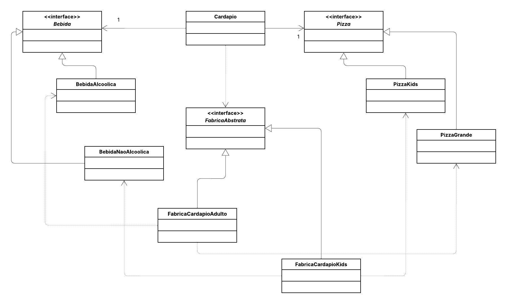

# 🍔 Sistema de Gestão de Cardápios

Este projeto implementa **o padrão de projeto criacional Abstract Factory (Fábrica Abstrata)**.
O objetivo é simular **a criação de diferentes famílias de produtos (Pizza e Bebida) para tipos específicos de cardápios (Adulto e Kids)**, além de aplicar o **princípio Open/Closed (Aberto para extensão, fechado para modificação), permitindo adicionar novos tipos de cardápio sem alterar o código do cliente (Cardapio)**.

---
## 📌 Diagrama de Classes

---

## 👩‍💻 Autora

**Eduarda Araujo Carvalho** 
